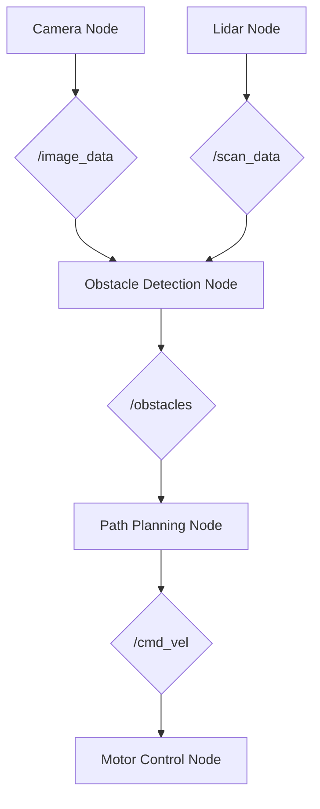

# Module 1: The Robotic Nervous System (ROS 2)

**Target Audience**: Students and developers with a basic understanding of computer science, Python, and command-line interfaces. No prior ROS 2 experience is required, but familiarity with robotics concepts is beneficial.

**Learning Goals**:
- Understand the fundamental concepts of ROS 2: nodes, topics, services, actions, and parameters.
- Learn how to create and run ROS 2 nodes in Python.
- Master the pub/sub (publisher/subscriber) communication pattern for data streaming.
- Implement request/response communication using ROS 2 services.
- Gain hands-on experience with ROS 2 command-line tools for introspection and debugging.

---

## 1.1 Introduction: What is a Robot's Nervous System?

Just as a biological organism relies on a nervous system to perceive, process, and act, a robot relies on a sophisticated software framework. This framework acts as the robot's digital nervous system, managing communication between its various components—sensors (eyes, ears), actuators (motors, grippers), and the "brain" (computational units).

In modern robotics, the **Robot Operating System (ROS)** has become the de facto standard for this nervous system. It is not an operating system in the traditional sense, like Windows or Linux. Instead, it is a **middleware**: a collection of software frameworks, tools, and conventions that simplify the task of creating complex and robust robot behavior.

This module focuses on **ROS 2**, the second generation of ROS, which offers significant improvements in performance, security, and scalability, making it suitable for both academic research and commercial products.

## 1.2 The Core of ROS 2: Nodes

Everything in ROS 2 is built around the concept of a **Node**. A node is the smallest unit of computation. Think of it as a single, dedicated process responsible for one specific task. For example, you might have:
- A node for reading data from a camera.
- A node for controlling the wheel motors.
- A node for processing sensor data to detect obstacles.
- A node for planning a path from point A to point B.

This modular approach is the cornerstone of ROS 2's power and flexibility. By breaking a complex robotics system down into many small, independent nodes, we can develop, test, and reuse components easily.

Below is a conceptual diagram of a simple mobile robot's node structure.


*A conceptual diagram showing how different nodes in a robotic system might communicate.*

## 1.3 Communication Patterns: Topics, Services, and Actions

Nodes would be useless if they couldn't communicate. ROS 2 provides several powerful communication patterns.

### Topics: The Broadcasting System
**Topics** are the most common communication method in ROS 2. They follow a **publish/subscribe** (pub/sub) pattern.
- A **Publisher** node continuously broadcasts data on a specific topic (e.g., `/camera/image_raw`).
- One or more **Subscriber** nodes can listen to that topic to receive the data.

This is an anonymous, asynchronous model. The publisher doesn't know or care how many subscribers there are (if any), and the subscribers don't know who the publisher is. This decoupling is perfect for streaming sensor data.

#### Example Code: A Simple Publisher
Here is a simple Python node that publishes a "Hello, World!" message every second.

```python
// code_examples/module1/talker.py
```

To run this code, you would use the ROS 2 command-line interface. We will explore this in detail later.

### Services: The Request/Response Model
While topics are great for continuous data streams, sometimes you need a direct request/response interaction. This is where **Services** come in.
- A **Service Server** node offers a specific service (e.g., `/calculate_trajectory`).
- A **Service Client** node can send a single request to the server and will wait for a single response.

This is a synchronous, one-to-one communication model, ideal for tasks like triggering a calculation, changing a setting, or asking for a specific piece of data.

### Actions: For Long-Running Tasks
What if a task takes a long time to complete, like navigating to a goal? A service would block the client for the entire duration. An **Action** is designed for these scenarios.
- An **Action Server** provides a long-running task.
- An **Action Client** sends a goal to the server.
- The server provides continuous **feedback** (e.g., distance to goal) and a final **result** when the task is done. The client can also cancel the goal.

## 1.4 Hands-On: Your First ROS 2 Workspace

Let's get our hands dirty. A ROS 2 workspace is a directory where you store and build your custom ROS 2 packages.

**1. Create a Workspace:**
Open your Ubuntu terminal (that you set up in Phase 2) and run:
```bash
mkdir -p ~/ros2_ws/src
cd ~/ros2_ws
```

**2. Create Your First Package:**
We'll use the ROS 2 tools to create a Python package.
```bash
cd src
ros2 pkg create --build-type ament_python my_first_package --dependencies rclpy
```

**3. Build the Workspace:**
Navigate back to the root of the workspace and build it.
```bash
cd ~/ros2_ws
colcon build
```
If the build is successful, you'll see new `build`, `install`, and `log` directories.

**4. Source the Workspace:**
Before you can use the nodes in your new package, you need to source your workspace's setup file.
```bash
source ~/ros2_ws/install/setup.bash
```
*Pro-tip: Add this command to your `~/.bashrc` file to avoid running it in every new terminal.*

## 1.5 The ROS 2 Command Line Interface (CLI)

The ROS 2 CLI is an indispensable set of tools for inspecting, debugging, and running your robotic system. Here are some of the most important commands.

- `ros2 run <package_name> <executable_name>`: Runs a node.
- `ros2 topic list`: Lists all active topics.
- `ros2 topic echo <topic_name>`: Prints the data being published on a topic.
- `ros2 node list`: Lists all active nodes.
- `ros2 node info <node_name>`: Shows detailed information about a node, including its topics, services, and actions.
- `ros2 launch <package_name> <launch_file_name>`: A powerful way to run multiple nodes at once, which we will explore next.

## 1.6 Launch Files: Orchestrating Your System

Running each node in a separate terminal is tedious. **Launch files** are Python scripts that allow you to describe and run a complex system of multiple nodes with a single command.

#### Example Code: A Simple Launch File
This launch file starts both our talker and a listener node.

```python
// code_examples/module1/simple_launch.py
```

You would run this with:
`ros2 launch my_first_package simple_launch.py`

---

## Conclusion

In this module, you have learned the foundational concepts of ROS 2, the digital nervous system for modern robots. You now understand nodes, topics, services, and actions, and you have gained hands-on experience with creating a workspace, building packages, and using the ROS 2 CLI. The skills you've acquired here are the building blocks for the more advanced topics we will cover in the rest of this book.

## References
1. ROS 2 Documentation: [docs.ros.org](https://docs.ros.org/en/humble/index.html)
2. *Robotics, Vision and Control: Fundamental Algorithms in MATLAB* by Peter Corke.
3. *Introduction to Robotics: Mechanics and Control* by John J. Craig.
