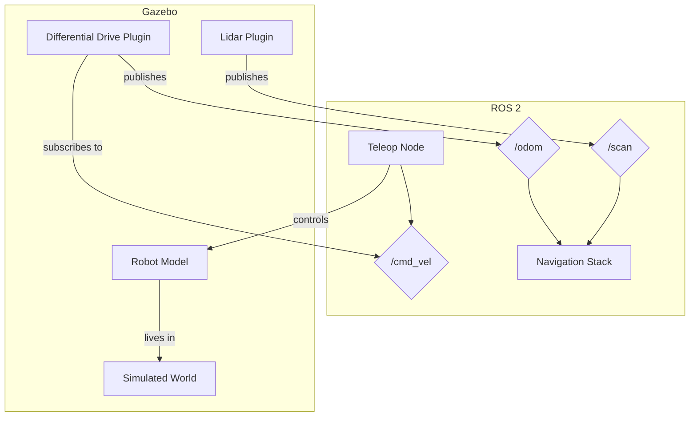

# Module 2: The Digital Twin (Gazebo & Unity)

**Target Audience**: Students who have completed Module 1 and are comfortable with ROS 2 concepts.

**Learning Goals**:
- Understand the concept and importance of a "Digital Twin" in robotics.
- Learn to create a simple robot model using Universal Robot Description Format (URDF).
- Simulate the robot model in a realistic 3D environment using Gazebo.
- Understand how ROS 2 integrates with simulation environments to test and validate robot behavior.
- Get a high-level overview of alternative simulation platforms like Unity.

---

## 2.1 The Power of Simulation: What is a Digital Twin?

In robotics, a **Digital Twin** is a virtual replica of a physical robot. This is not just a 3D model; it's a dynamic simulation that includes the robot's physical properties (mass, inertia), sensors, actuators, and the environment it operates in.

Why is this so important?
- **Safety**: Testing new AI algorithms on a real, expensive humanoid robot is risky. A simulation allows for safe failure.
- **Speed**: You can run simulations much faster than real-time, accelerating development and testing cycles.
- **Scalability**: You can run thousands of parallel simulations in the cloud to train an AI model on a vast range of scenarios—something impossible in the real world.
- **Cost-Effectiveness**: It eliminates the need for physical hardware during the initial stages of development.

In this module, we will focus on **Gazebo**, a powerful, open-source 3D robotics simulator that integrates seamlessly with ROS 2.

## 2.2 Describing Your Robot: URDF

To simulate a robot, we first need to describe it. The **Universal Robot Description Format (URDF)** is an XML-based standard for representing a robot model in ROS. A URDF file defines:
- **Links**: The rigid parts of the robot (e.g., the chassis, a wheel, an arm segment).
- **Joints**: How the links are connected (e.g., `revolute` for a wheel, `continuous` for a rotating sensor).
- **Visuals**: The 3D shape and appearance of each link.
- **Collisions**: The collision geometry of each link, used by the physics engine.
- **Inertia**: The mass and inertial properties of each link.

#### Example Code: A Simple Two-Wheeled Robot URDF
Here is a simplified URDF for a differential drive robot.

```xml
<!-- code_examples/module2/simple_robot.urdf -->
```

This file defines a chassis, two wheels, and a caster wheel, along with their joints and visual properties.

## 2.3 Welcome to the Matrix: The Gazebo Simulator

Gazebo provides the virtual world for our digital twin. It includes:
- **Physics Engine**: Simulates gravity, friction, and collisions.
- **Sensor Simulation**: Can generate realistic data for cameras, LiDAR, IMUs, and more.
- **World Files**: Allows you to create complex environments with obstacles, lighting, and different ground planes.

The magic happens when we connect Gazebo to ROS 2. The `gazebo_ros_pkgs` provide plugins that create a bridge between them. For example, a Gazebo camera plugin can publish simulated images directly to a ROS 2 topic, which your perception nodes can then subscribe to, just as if it were a real camera.

#### Example Diagram: ROS 2 and Gazebo Integration

*This diagram shows how a ROS 2 Teleop node can send velocity commands to a Gazebo plugin, which moves the robot. In turn, Gazebo sensor plugins publish odometry and laser scan data back to ROS 2 topics.*

## 2.4 Launching Your Digital Twin

To bring everything together, we use a ROS 2 launch file. This file will:
1. Start the Gazebo simulator with a specified world.
2. Spawn your URDF robot model into the simulation.
3. Start the `robot_state_publisher` node, which reads the URDF and broadcasts the robot's structure to ROS 2.

#### Example Code: Spawning a Robot in Gazebo
Here is a launch file that accomplishes the steps above.

```python
// code_examples/module2/spawn_robot.launch.py
```
When you run this launch file, you should see the Gazebo GUI open with your two-wheeled robot sitting in an empty world.

## 2.5 Alternative Simulators: A Look at Unity

While Gazebo is the most common simulator in the ROS ecosystem, other powerful options exist, particularly in the realm of high-fidelity graphics and photorealism.

**Unity** is a professional game engine that has seen increasing adoption in robotics, especially for training vision-based AI models.
- **Advantages**: Photorealistic rendering, powerful physics, and a vast asset store.
- **ROS Integration**: Using packages like the `ros-tcp-connector`, you can establish a communication bridge between your Unity simulation and your ROS 2 nodes.

The choice between Gazebo and Unity often depends on the goal. For core robotics algorithm development, Gazebo is often faster and more straightforward. For training perception algorithms that rely on realistic visual data, Unity is a superior choice.

---

## Conclusion
You have now created a digital twin of a robot, described it using URDF, and simulated it in Gazebo. You understand how ROS 2 and a simulator work together to create a powerful and safe development environment. This virtual robot will be the foundation for the AI we will build in the next module.

## References
1. Gazebo Simulator Official Website: [gazebosim.org](https://gazebosim.org/)
2. URDF Documentation: [wiki.ros.org/urdf](http://wiki.ros.org/urdf)
3. Unity Robotics Hub: [github.com/Unity-Technologies/Unity-Robotics-Hub](https://github.com/Unity-Technologies/Unity-Robotics-Hub)
