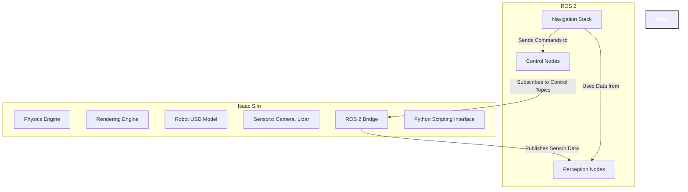

# Module 3: The AI-Robot Brain (NVIDIA Isaac™)

**Target Audience**: Students who have completed Modules 1 & 2 and have a foundational understanding of ROS 2 and robotics simulation.

**Learning Goals**:
- Understand the role of a high-performance simulation platform for AI development in robotics.
- Learn the core concepts of NVIDIA's Isaac Sim platform.
- Discover how to import and simulate a ROS 2-enabled robot in Isaac Sim.
- Understand the concept of Synthetic Data Generation (SDG) for training perception models.
- Get a high-level overview of connecting AI models (perception, navigation) to a simulated robot.

---

## 3.1 Beyond Gazebo: The Need for High-Fidelity Simulation

In Module 2, you learned how to simulate a robot in Gazebo. While Gazebo is an excellent tool for many robotics tasks, the world of AI-driven robotics often demands a higher level of realism, especially for training perception and interaction algorithms.

This is where platforms like **NVIDIA Isaac Sim** shine. Built on top of NVIDIA's Omniverse platform, Isaac Sim is a photorealistic, physics-accurate virtual environment designed specifically for developing, testing, and training AI-based robots.

Key advantages of Isaac Sim include:
-   **Photorealism**: With real-time ray tracing, it can produce stunningly realistic sensor data, which is crucial for training vision models that will later be deployed in the real world.
-   **Physics Accuracy**: It leverages the powerful PhysX 5 engine, enabling highly accurate simulation of complex robot dynamics and interactions.
-   **Seamless ROS/ROS 2 Integration**: Isaac Sim is designed from the ground up to connect with ROS, making it easy to integrate with your existing nodes.
-   **Synthetic Data Generation (SDG)**: It provides powerful tools to automatically generate vast amounts of labeled data for training machine learning models.

## 3.2 Introduction to NVIDIA Isaac Sim

Isaac Sim works by extending the Universal Scene Description (USD) framework, an open-source 3D scene description format, with robotics-specific schemas and tools.

At its core, you will work with:
-   **The Stage**: This is the main viewport where you compose your 3D scene, including the robot, the environment, lighting, and cameras.
-   **ROS 2 Bridge**: A core component that provides a bidirectional connection between Isaac Sim and ROS 2. It can automatically publish sensor data (from simulated cameras, LiDARs) to ROS 2 topics and subscribe to ROS 2 topics (like `/cmd_vel`) to control the robot.
-   **Python Scripting**: The entire simulation is controllable via Python APIs. You can write scripts to control the simulation, manipulate objects, and generate synthetic data.

#### Conceptual Diagram: Isaac Sim and ROS 2

*This diagram illustrates how Isaac Sim's ROS 2 Bridge acts as the central link between the high-fidelity simulation environment and the ROS 2 computational graph.*

## 3.3 Importing Your Robot into Isaac Sim

One of the powerful features of Isaac Sim is its ability to import existing robot descriptions. You can take the URDF file you created in Module 2 and import it into Isaac Sim. The platform will automatically convert it to the USD format.

Once imported, you can use the Isaac Sim UI and Python APIs to:
1.  **Add high-fidelity materials** to your robot model to make it look realistic.
2.  **Configure physics properties** for accurate simulation.
3.  **Add and configure simulated sensors**, such as RTX-enabled cameras and LiDARs.
4.  **Attach ROS 2 components** to the robot, such as a differential drive controller that subscribes to `/cmd_vel`.

#### Example Code: Spawning a Robot with Python
While you can do this through the UI, automating it with Python is more powerful and repeatable.

```python
# code_examples/module3/spawn_robot_isaac.py
```

This script would load your robot from a USD file and place it at a specific location in the virtual world.

## 3.4 Synthetic Data Generation (SDG) for AI Training

Perhaps the most important feature of Isaac Sim for AI robotics is **Synthetic Data Generation**.

Imagine you need to train a neural network to detect a specific object. In the real world, you would need to collect thousands of images of that object in different lighting conditions and from different angles, and then manually label them all. This is incredibly time-consuming.

With SDG in Isaac Sim, you can write a simple Python script that:
1.  **Randomizes** the position, orientation, and color of the object.
2.  **Randomizes** the lighting in the scene.
3.  **Randomizes** the camera's position and angle.
4.  For each randomization, it captures an image and **automatically saves perfect labels**, such as bounding boxes, instance segmentation masks, or depth images.

This allows you to generate a massive, diverse, and perfectly labeled dataset in a fraction of the time it would take to collect real-world data.

## 3.5 Integrating an AI Brain

Once you have a trained model, Isaac Sim is the perfect place to test it before deploying it on a real robot. The workflow looks like this:

1.  **Run your trained model** in a dedicated ROS 2 node (the "AI Brain"). This node might subscribe to `/camera/image_raw` from the simulator.
2.  **Process the image** with your model to make a decision (e.g., "object detected on the left").
3.  **Publish a command** to a control topic (e.g., `/cmd_vel`) based on the model's output.
4.  The Isaac Sim robot, subscribing to `/cmd_vel`, executes the command in the simulation.
5.  You can observe the robot's behavior and debug the entire perception-to-action loop in a safe, controlled, and realistic environment.

---

## Conclusion

You now understand the critical role high-fidelity, GPU-accelerated simulation plays in developing the "AI Brain" for a modern robot. You have been introduced to NVIDIA Isaac Sim and its core capabilities, from importing a robot to generating synthetic data. In the final module, we will dive deeper into the AI models themselves and build a complete Vision-Language-Action system.

## References
1.  NVIDIA Isaac Sim Documentation: [https://developer.nvidia.com/isaac-sim](https://developer.nvidia.com/isaac-sim)
2.  Universal Scene Description (USD): [https://openusd.org/](https://openusd.org/)
3.  *Deep Learning for Vision Systems* by Mohamed Elgendy.
