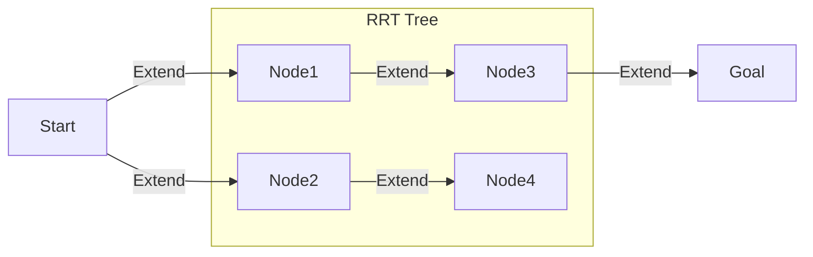

# Module 5: Advanced AI & Motion Control

**Target Audience**: Students and developers familiar with ROS 2, robotics simulation (Gazebo, Isaac Sim), and basic AI/ML concepts, as covered in Modules 1-4.

**Learning Goals**:
-   Understand the theoretical foundations of Reinforcement Learning (RL) in robotics.
-   Explore classic and advanced Motion Planning algorithms and their applications.
-   Grasp the principles of Trajectory Optimization for efficient and smooth robot movements.
-   Learn about Model Predictive Control (MPC) for dynamic and constraint-aware robot control.
-   Understand how these AI techniques enable humanoid robots to make intelligent decisions and execute complex motions.
-   Recognize the integration points with ROS 2 and NVIDIA Isaac Sim for practical implementation.

---

## 5.1 Overview: The Intelligent Choreography of Humanoids

In previous modules, we established the robot's nervous system with ROS 2 and its digital twin in high-fidelity simulators. Now, we delve into the "brain" itself: how advanced AI techniques enable humanoid robots to move intelligently, adapt to their environment, and perform complex tasks with grace and efficiency. This involves teaching robots not just *how* to move, but *what* to do and *when* to do it, making them truly autonomous and capable.

This module focuses on the trio of advanced control paradigms: **Reinforcement Learning (RL)** for learned behaviors, **Motion Planning** for navigating complex spaces, and **Model Predictive Control (MPC)** for agile, dynamic execution.

## 5.2 Reinforcement Learning Basics for Robotics

**Reinforcement Learning (RL)** is a paradigm where an agent learns to make decisions by performing actions in an environment and receiving rewards or penalties. The goal is to learn a policy that maximizes the cumulative reward over time. In robotics, this translates to teaching a robot desired behaviors through trial and error, much like how animals learn.

Key concepts in RL for robotics:
-   **Agent**: The robot itself.
-   **Environment**: The physical or simulated world the robot operates in.
-   **State**: The current condition of the robot and its surroundings (e.g., joint angles, sensor readings).
-   **Action**: A movement or decision made by the robot (e.g., applying torque to a joint).
-   **Reward**: A scalar feedback signal indicating how good or bad the robot's action was.
-   **Policy**: A mapping from states to actions, which the agent learns.

RL is particularly powerful for humanoid robots because it can learn highly complex, non-linear control policies that are difficult to program manually, such as bipedal walking, balancing, or manipulating diverse objects.

#### Illustrative Diagram: Reinforcement Learning Loop
```mermaid
graph TD;
    A[Environment] --> B{State, Reward};
    B --> C[Agent (Policy)];
    C --> D[Action];
    D --> A;
```
*A basic diagram illustrating the continuous feedback loop in Reinforcement Learning.*

### RL with Humanoids: Challenges and Solutions
Training humanoid robots with RL presents unique challenges due to their high dimensionality, complex dynamics, and the "curse of dimensionality." Solutions often involve:
-   **Sim-to-Real Transfer**: Training in simulation and deploying to the real world.
-   **Hierarchical RL**: Breaking down complex tasks into simpler sub-tasks.
-   **Reward Shaping**: Carefully designing reward functions to guide learning.

## 5.3 Motion Planning Algorithms (RRT, PRM)

**Motion Planning** is the task of finding a valid path from a start configuration to a goal configuration for a robot, avoiding obstacles and respecting robot constraints. For humanoid robots, this is critical for navigation and manipulation tasks.

### Rapidly-exploring Random Tree (RRT)
**RRT** is a sampling-based motion planning algorithm that quickly explores the state space by building a tree from the start configuration. It randomly samples points in the configuration space and tries to connect the closest existing tree node to the new sample. This process rapidly "grows" the tree until it reaches the goal or a connection to the goal is found.

-   **Advantages**: Probabilistically complete (will find a path if one exists), good for high-dimensional spaces.
-   **Disadvantages**: Paths are often sub-optimal (jagged).

#### Illustrative Diagram: RRT Pathfinding

*A simplified representation of the Rapidly-exploring Random Tree (RRT) algorithm finding a path from Start to Goal.*

### Probabilistic Roadmap (PRM)
**PRM** is another sampling-based algorithm that constructs a roadmap (graph) of the environment. It involves two phases:
1.  **Construction Phase**: Randomly samples points in the configuration space, connects nearby valid samples to form a graph (roadmap), avoiding obstacles.
2.  **Query Phase**: Given a start and goal, it connects them to the roadmap and then uses a graph search algorithm (like Dijkstra's or A\*) to find a path through the roadmap.

-   **Advantages**: Can quickly answer multiple queries after the roadmap is built.
-   **Disadvantages**: Roadmap construction can be time-consuming for very complex environments.

## 5.4 Trajectory Optimization Examples

Once a collision-free path is found by a motion planner, **Trajectory Optimization** refines this path into a smooth, dynamically feasible trajectory. This involves optimizing metrics like:
-   **Time**: Minimizing the time taken to complete the motion.
-   **Energy**: Minimizing energy consumption.
-   **Smoothness**: Ensuring smooth joint movements to prevent wear and tear.
-   **Joint Limits**: Respecting velocity and acceleration limits of robot joints.

Trajectory optimization converts a sequence of static waypoints into a time-parameterized sequence of joint commands, ensuring the robot can actually execute the motion smoothly and safely.

## 5.5 Model Predictive Control (MPC) Concepts

**Model Predictive Control (MPC)** is an advanced control strategy that uses a dynamic model of the system to predict future behavior over a finite horizon. At each time step, MPC solves an optimization problem to determine the optimal control actions (e.g., joint torques) that minimize a cost function (e.g., tracking error, energy consumption) while satisfying constraints (e.g., joint limits, obstacle avoidance).

The key idea is that only the first action in the optimized sequence is applied to the system. Then, at the next time step, the process is repeated with a new measurement of the system's state. This "receding horizon" approach makes MPC highly robust to disturbances and model inaccuracies.

For humanoid robots, MPC is invaluable for dynamic tasks like walking, running, or balancing, where precise, real-time adjustments are crucial.

#### Illustrative Diagram: Model Predictive Control Workflow
```mermaid
graph TD;
    A[Current State (Sensors)] --> B{Predict Future States (Robot Model)};
    B --> C{Optimize Control Actions (Cost Function, Constraints)};
    C --> D[Apply First Action];
    D --> E[Robot Hardware/Simulation];
    E --> A;
```
*A diagram illustrating the receding horizon principle of Model Predictive Control (MPC).*

## 5.6 AI-driven Robot Decision-Making

Combining RL, Motion Planning, and MPC allows humanoid robots to make increasingly intelligent decisions:
-   **High-level (RL)**: Learning *what* task to perform or *how* to perform it at a strategic level (e.g., "walk to the door").
-   **Mid-level (Motion Planning)**: Finding a collision-free path *to* the door.
-   **Low-level (MPC)**: Generating the precise joint commands to execute the walk dynamically and robustly, adapting to terrain changes or disturbances in real-time.

This hierarchical approach is fundamental to achieving robust and autonomous humanoid robot behavior.

## Code Examples

The code examples for this module are located in `code_examples/module5/`. These are conceptual Python and ROS 2 scripts designed to illustrate the core principles. They assume a simulated humanoid robot environment in NVIDIA Isaac Sim.

### Motion Planning with ROS 2

A Python script demonstrating how to use a motion planning library (e.g., MoveIt 2's Python interface or a simplified RRT implementation) to find a path for a robot arm or a humanoid base in a cluttered environment. It would visualize the planned path.

```python
# code_examples/module5/motion_planning.py
```

### Trajectory Optimization

A Python script that takes a series of waypoints (from a motion planner) and optimizes them into a smooth, time-parameterized trajectory. This might involve polynomial interpolation or more advanced optimization techniques, respecting joint velocity and acceleration limits.

```python
# code_examples/module5/trajectory_optimization.py
```

### Simple Reinforcement Learning for Humanoid Steps

A conceptual Python script using a popular RL library (e.g., Stable Baselines3) to train a simple policy for a humanoid robot to take a single step or maintain balance. This would highlight the agent-environment interaction, reward function, and policy update.

```python
# code_examples/module5/rl_humanoid_steps.py
```

## Illustrative Diagrams

-   **RL Loop**: A feedback loop illustrating the interaction between agent, environment, state, action, and reward. (Already described with Mermaid)
-   **RRT Pathfinding**: A visual representation of the RRT algorithm growing a tree in a 2D space to find a path around obstacles. (Already described with Mermaid)
-   **MPC Workflow**: A diagram showing the receding horizon control loop with prediction, optimization, and action application. (Already described with Mermaid)

## References

1.  Sutton, R. S., & Barto, A. G. (2018). *Reinforcement Learning: An Introduction* (2nd ed.). MIT Press.
2.  LaValle, S. M. (2006). *Planning Algorithms*. Cambridge University Press.
3.  *Model Predictive Control: Theory, Computation, and Design* by J. Maciejowski.
4.  ROS 2 Control Documentation: [docs.ros.org/ros2_control/](https://docs.ros.org/en/ros2_control/latest/doc/index.html)
5.  NVIDIA Isaac Sim Documentation: [developer.nvidia.com/isaac-sim](https://developer.nvidia.com/isaac-sim)
6.  Stable Baselines3 Documentation: [stable-baselines3.readthedocs.io](https://stable-baselines3.readthedocs.io/en/master/)
